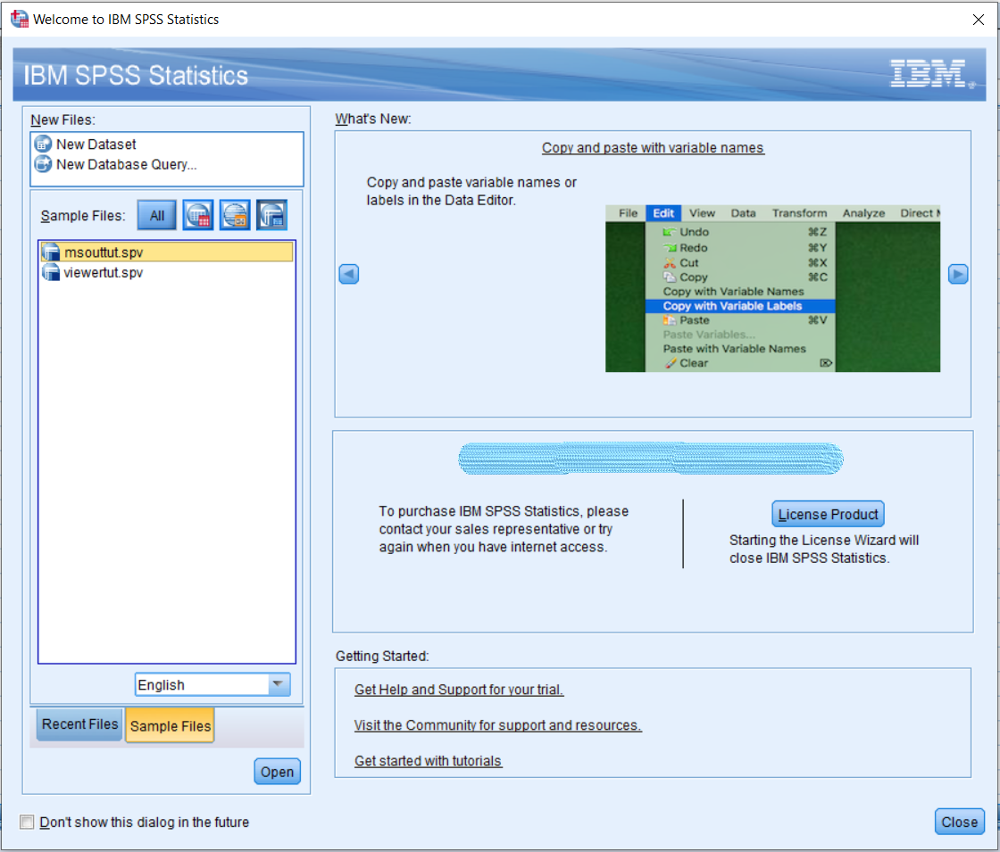
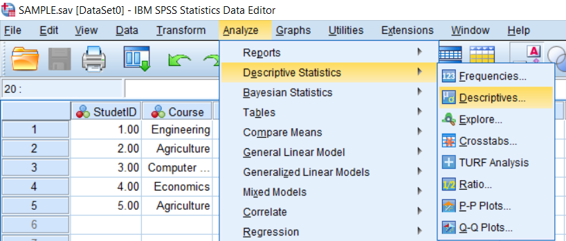
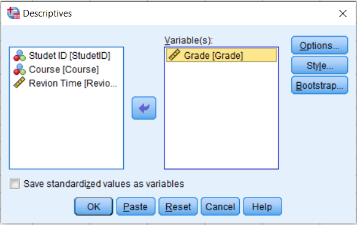
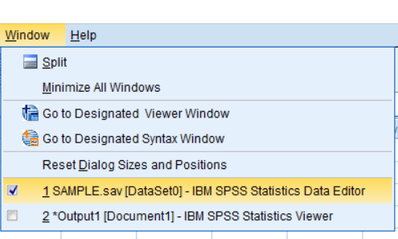
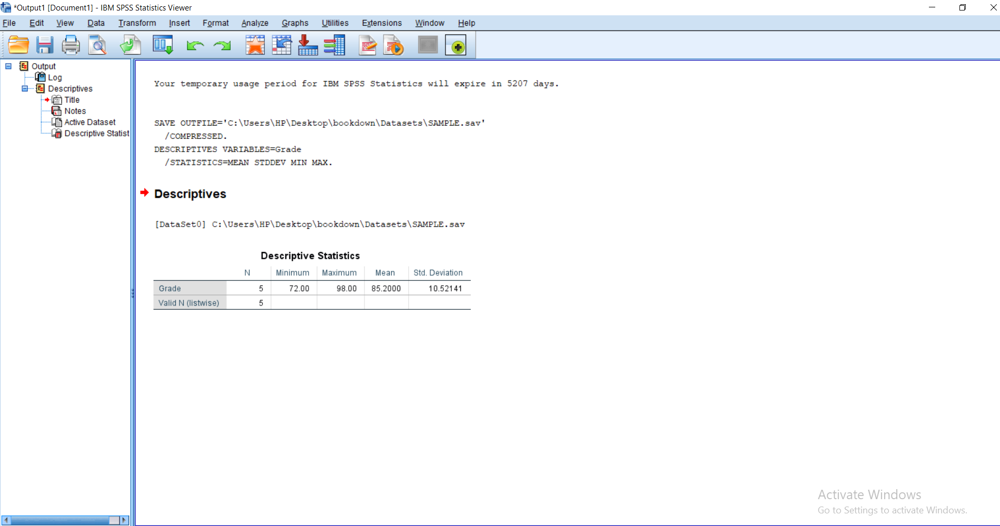
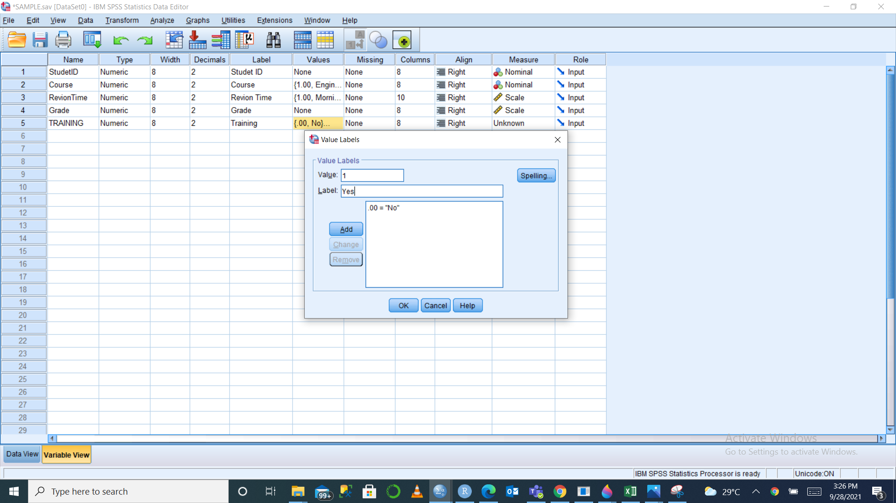

--- 
title: "Data and Analytics in SPSS: \\ A Step-By-Step Guide to Analysis and Interpretation"
author: "Henry Njagi"
date: "`r Sys.Date()`"
site: bookdown::bookdown_site
output: bookdown::gitbook
documentclass: book
bibliography: [book.bib, packages.bib]
biblio-style: apalike
link-citations: yes
github-repo: rstudio/bookdown-demo
description: "This is a minimal example of using the bookdown package to write a book. The output format for this example is bookdown::gitbook."
---

# Prerequisites

This is a _sample_ book written in **Markdown**. You can use anything that Pandoc's Markdown supports, e.g., a math equation $a^2 + b^2 = c^2$.

The **bookdown** package can be installed from CRAN or Github:

```{r eval=FALSE}
install.packages("bookdown")
# or the development version
# devtools::install_github("rstudio/bookdown")
```

Remember each Rmd file contains one and only one chapter, and a chapter is defined by the first-level heading `#`.

To compile this example to PDF, you need XeLaTeX. You are recommended to install TinyTeX (which includes XeLaTeX): <https://yihui.name/tinytex/>.

```{r include=FALSE}
# automatically create a bib database for R packages
knitr::write_bib(c(
  .packages(), 'bookdown', 'knitr', 'rmarkdown'
), 'packages.bib')
```

<!--chapter:end:index.Rmd-->

# Introduction {#intro}

## Preliminary

The use of SPSS accommodates all people including the novice computer user and those with no previous experience using SPSS. The study chapters are divided into sub-sections that explains the statistics to be used, with underlying assumptions, and methodology for the results interpretation and express then in a research report. 

The genesis of the book explains how to start the SPSS, variable definitions, data entry and saving. All the necessary and fundamental statistics techniques are explained. These statistics included the descriptive statistics, data graphing, association and prediction, inferential statistics for parametric and nonparametric, and statistics for test construction.

The learners are expected to follow up with the sample screenshots. 

New to this edition 1:

Data and real output are now available for all Phrasing Results sections – eliminating hypothetical output or hypothetical data

<br> 
Henry Njagi is a lecturer and a Statistician with advanced knowledge in data and Analytics (MSc. in Applied Statistics, Jomo Kenyatta University of Agriculture and Technology).
</br>

<!--chapter:end:01-intro.Rmd-->

# Getting Started

## Starting SPSS
We want to appreciate different users are using different operating systems. The procedure to startup the SPSS may differ slightly.
This part uses screenshots from the window version of SPSS. Other window versions such as Unix and/or MacOS will have the same functionality, but could appear differently than what is being depiced herein.



When you start the SPSS, you will be presented with the above dialog box. This depends with the system administrator options that is working with your version program. On the $\textbf{dialog box}$, click Type in data and OK. Or just ($\textit{Close}$). This will present a blank data window.

The provided blank window have basic interface for SPSS. 


## Entering Data

Before you get to know the operability of SPSS, you must understnd the key to success with SPSS. You should understand how SPSS stores data and uses the data. In order to illustrate the hasics data entry with SPSS, we will use an example 2.1.1 

$\textbf{Example 2.1.1}$

A survey was given to different students from a college who were studying different courses (Enginnering, Economics, Computer Science, and Agriculture). The students were asked whether or not they revise extensively in the morning or late in the evening. This survey also asked for their first semester grade in the class (100% being the highest grade possible for all the courses). The response sheets fro the first 5 students are presented below


The main goal is to enter the data from the five college students into SPSS for the analysis. We first need to determine the variables that will be entered. A variable is any informtion that will keep on varying among participants. The variables we need from example 2.1.1 are:

StudetID:

Course:

Revion Time:

Grade %

Recall the blank SPSS window, there is two button (\textbf{Data View} and \textbf{Variable View}) on the bottom-left of the window. In the data view, we have columns and rows, the columns represents variables, and rows represent participants. Since the variables we have defined from example 2.1.1 have only four variables, therefore, we will create a data file with four columns, and five rows, each representing an entry from individual respondent/student.

## Defining Variables

Before we can enter any data, we must first enter some basic information about each variable into SPSS. For instance, variables must first be given names that

-- begin with a letter, and
-- do not contain a space.

Thus, the variable name “Q7” is acceptable, while the variable name “7Q” is not. Similarly, the variable name “PRE_TEST” is acceptable, but the variable name “PRE TEST” is not. Capitalization does not matter, but variable names are capitalized in this text to make it clear when we are referring to a variable name, even if the variable name is not necessarily capitalized in screenshots.

To define a variable, click on the Variable View tab at the bottom of the main screen $\textbf{refer to the SPSS Blank Window}$. This will show you the Variable View window. To return to the Data View window, click on the Data View tab.

From the Variable View screen, SPSS allows you to create and edit all of the variables in your data file. Each column represents some property of a variable, and each row represents a variable. All variables must be given a name. To do that, click on the first empty cell in the Name column and type a valid SPSS variable name. The program will then fill in default values for most of the other properties.

One useful function of SPSS is the ability to define variable and value labels. Variable labels allow you to associate a description with each variable.


Value labels allow you to associate a description with each value of a variable. For instance, for most procedures, SPSS requires numerical values. Thus, for data such as the course (i.e., Engineering, Economic, Computer Science, and Agriculture), we need to first code the values as numbers. We can assign the number 1 to Engineering, 2 to Economic, 3 to Computer Science, and 4 to Agriculture. To help us keep track of the numbers we have assigned to the values, we use value labels.

To assign value labels, click in the cell you want to assign values to in the Values column (in this case, for Variable 2 i.e., the course). This will bring up a small gray button (shown below). Click on that button to bring up the Value Labels dialog box. The revision time should also be coded as 1 = Morning, and 2 = Evening.


When you enter a value label, you must click $\textit{Add}$ after each entry. This will move the value and its associated label into the bottom section of the window. When all labels have been added, click $\textit{OK}$ to return to the Variable View window.

In addition to naming and labeling the variable, you have the option of defining the variable type. To do so, simply click on the Type, Width, or Decimals columns in the Variable View window. The default value is a numeric field that is eight digits wide with two decimal places displayed. If your data are more than eight digits to the left of the decimal place, they will be displayed in scientific notation (e.g., the number 2,000,000,000 will be displayed as 2.00E+09). SPSS maintains accuracy beyond two decimal places, but all output will be rounded to two decimal places unless otherwise indicated in the Decimals column.

There are several other options available in this screen, which are beyond the scope of this text. In our example, we will be using numeric variables with all the default values.

After you have coded the book, click on the Data View tab to open the data-entry screen. Enter data horizontally, beginning with the first student’s ID number. Enter the code for each variable in the appropriate column. To enter the GRADE variable value, enter the student’s class/semester grade.


The previous data window can be changed to look like the screenshot on the next page by clicking on the Value Labels icon ($\textbf{see below}$). In this case, the cells display value labels rather than the corresponding codes. If data are entered in this mode, it is not necessary to enter codes, as clicking the button that appears in each cell as the cell is selected will present a drop-down list of the predefined labels. You may use whichever method you prefer.


## Loading and Saving Data Files

Once you have entered your data, you will need to save it with a unique name so that you can retrieve it when necessary for later use.

Loading and saving SPSS data files works in the same way as most Windows-based software. Under the File menu, there are Open, Save, and Save As commands. SPSS data files have a “.sav” extension, which is added by default to the end of the filename (that is, do not type “.sav” after the filename; SPSS will add it automatically). This tells Windows that the file is an SPSS data file. Other SPSS extensions include “.spv” for saved output files and “.sps” for saved syntax files.


When you save your data file (by clicking File, then clicking Save or Save As to specify a unique name), pay special attention to where you save it. You will probably want to save your data on a removable USB drive so that you can take the file with you.

## Load Your Data

When you load your data (by clicking File, then clicking Open, then Data, or by clicking the open file folder icon), you get a similar window. This window lists all files with the “.sav” extension. If you have trouble locating your saved file, make sure you are looking in the right directory.


## Running Your First Analysis

Any time you open a data window, you can run any of the analyses available. To get started, we will calculate the students’ average grade. (With only five students, you can easily check your answer by hand, but imagine a data file with 50,000 student records.)

The majority of the available statistical tests are under the Analyze menu. This menu displays all the options available for your version of the SPSS program (the menus in this book were created with SPSS Statistics Version 25). Other versions may have slightly different sets of options.

To calculate a mean (average), we are asking the computer to summarize our dataset. Therefore, we run the command by clicking Analyze, then Descriptive Statistics, then Descriptives.



This brings up the Descriptives dialog box. Note that the left side of the box contains a list of all the variables in our data file. On the right is an area labeled Variable(s), where we can specify the variables we would like to use in this particular analysis.


We want to compute the mean for the variable called GRADE. Thus, we need to select the variable name in the left window (by clicking on it). To transfer it to the right window, click on the right arrow between the two windows. The arrow always points to the window opposite the highlighted item and can be used to transfer selected variables in either direction. Note that double-clicking on the variable name will also transfer the variable to the opposite window. Standard Windows conventions of “Shift” clicking or “Ctrl” clicking to select multiple variables can be used as well. Note: Some configurations of SPSS show the variable names, and others show the variable labels (if any). This can be changed under Edit → Options → General.



When we click on the OK button, the analysis will be conducted, and we will be ready to examine our output.

## Examining and Printing Output Files

After an analysis is performed, the output is placed in the output window, and the output window becomes the active window. If this is the first analysis you have conducted since starting SPSS, then a new output window will be created. If you have run previous analyses and saved them, your output is added to the end of your previous output.

To switch back and forth between the data window and the output window, select the desired window from the Window menu bar. Alternately, you can select the window using the taskbar at the bottom of the screen.



The output window is split into two sections. The left section is an outline of the output (SPSS refers to this as the outline view). The right section is the output itself.



The section on the left of the output window provides an outline of the entire output window. All of the analyses are listed in the order in which they were conducted. Note that this outline can be used to quickly locate a section of the output. Simply click on the section you would like to see, and the right window will jump to the appropriate place.

Clicking on a statistical procedure also selects all of the output for that command. By pressing the Delete key, that output can be deleted from the output window. This is a quick way to be sure that the output window contains only the desired output. Output can also be selected and pasted into a word processor or spreadsheet by clicking Edit, then Copy to copy the output. You can then switch to your word processor and click Edit, then Paste.

To print your output, simply click File, then Print, or click on the printer icon on the toolbar. You will have the option of printing all of your output or just the currently selected section. Be careful when printing! Each time you run a command, the output is added to the end of your previous output. Thus, you could be printing a very large output file containing information you may not want or need.

One way to ensure that your output window contains only the results of the current command is to create a new output window just before running the command. To do this, click File, then New, then Output. All your subsequent commands will go into your new output window.

You can also save your output files as SPSS format files (.spv extension). Note that SPSS saves whatever window you have open. If you are on a data window you will save your data. If you are on an output window it will save your output.

$\textbf{Practice Exercise}$

Load the sample data file you created earlier (SAMPLE.sav). Run the Descriptives command for the variable GRADE, and print the output. Next, select the data window and print it.

## Modifying Data Files

Once you have created a data file, it is really quite simple to add additional cases (rows/participants) or additional variables (columns). 


To add the data, simply place two additional rows in the Data View window (after loading your sample data). Notice that as new participants are added, the row numbers become bold. When done, the screen should look like the screenshot above.

New variables can also be added. For example, if the first three participants were given special training on time management, and the four new participants were not, the data file can be changed to reflect this additional information. The new variable could be called TRAINING (whether or not the participant received training), and it would be coded so that 0 = No and 1 = Yes. Thus, the first three participants would be assigned a “1” and the last four participants a “0.” To do this, switch to the Variable View window, then add the TRAINING variable to the bottom of the list. Then switch back to the Data View window to update the data.



Adding data and variables are logical extensions of the procedures we used to originally create the data file. Save this new data file. We will be using it again later in this book.

$\textdb{Practice Exercise}$
Follow the previous example (where TRAINING is the new variable). Make the modifications to your SAMPLE.sav data file and save it.

<!--chapter:end:02-Getting-Started.Rmd-->

# Getting Started

## Starting SPSS
We want to appreciate different users are using different operatig systems. The procedure to startup the SPSS may differ slightly.
This part uses screenshots from the window version of SPSS. Other window versions such as Unix and/or MacOS will have the same functionality, but could appear differently than what is being depiced herein.


<!--chapter:end:02-literature.Rmd-->

# Methods

We describe our methods in this chapter.

Math can be added in body using usual syntax like this 

## math example

$p$ is unknown but expected to be around 1/3. Standard error will be approximated

$$
SE = \sqrt(\frac{p(1-p)}{n}) \approx \sqrt{\frac{1/3 (1 - 1/3)} {300}} = 0.027
$$

You can also use math in footnotes like this^[where we mention $p = \frac{a}{b}$].

We will approximate standard error to 0.027[^longnote]

[^longnote]: $p$ is unknown but expected to be around 1/3. Standard error will be approximated

    $$
    SE = \sqrt(\frac{p(1-p)}{n}) \approx \sqrt{\frac{1/3 (1 - 1/3)} {300}} = 0.027
    $$

<!--chapter:end:03-method.Rmd-->

# Applications

Some _significant_ applications are demonstrated in this chapter.

## Example one

## Example two

<!--chapter:end:04-application.Rmd-->

# Final Words

We have finished a nice book.

<!--chapter:end:05-summary.Rmd-->

`r if (knitr:::is_html_output()) '
# References {-}
'`

<!--chapter:end:06-references.Rmd-->

# Copyright

First edition published 2020

2021 Henry Njagi

The right of Henry Njagi to be identified as author of this work has been asserted by him in accordance with sections 77 and 78 of the Copyright, Designs and Patents Act 1988.

All rights reserved. No part of this book may be reprinted or reproduced or utilised in any form or by any electronic, mechanical, or other means, now known or hereafter invented, including photocopying and recording, or in any information storage or retrieval system, without permission in writing from the publishers.


Visit the Author Gmail: hnjagimgmil.com

<!--chapter:end:07-copyright-page.Rmd-->

